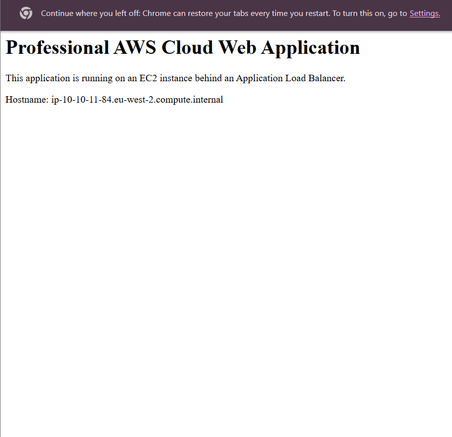
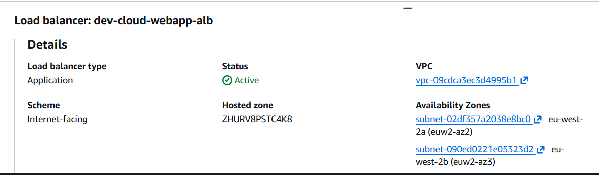
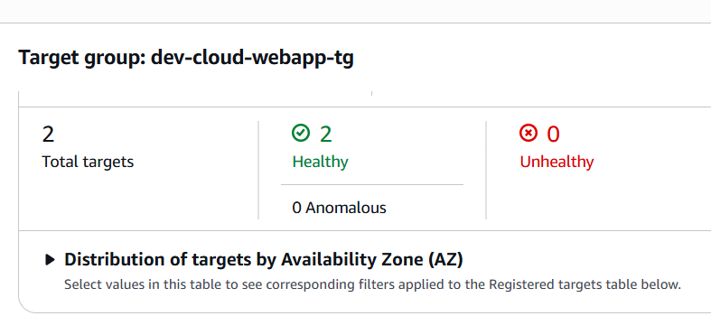
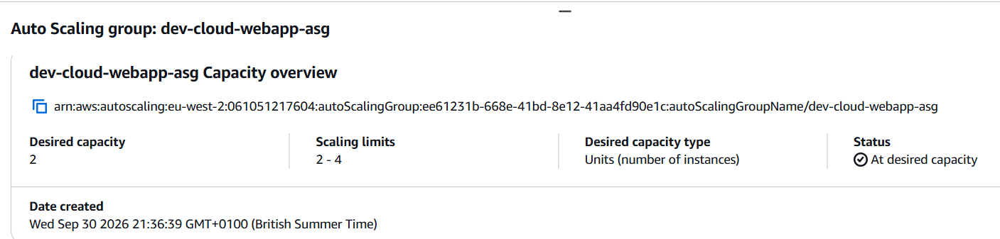
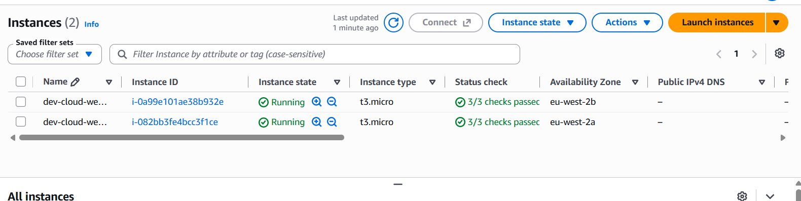
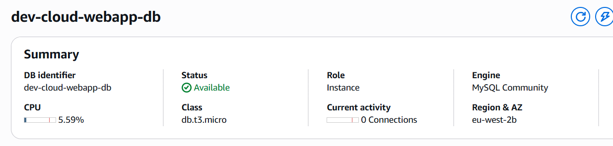
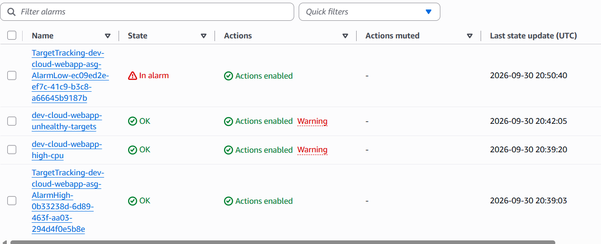
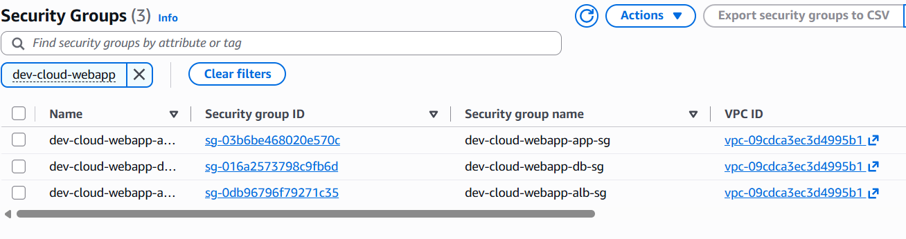
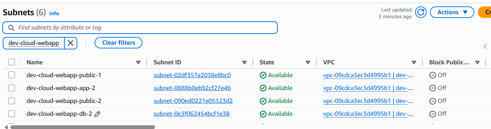

# Professional AWS Cloud Web Application

This is a student cloud engineering project developed to learn how AWS services can be designed, deployed and managed using Terraform.

The project demonstrates a highly available web application architecture using AWS networking, EC2, an Application Load Balancer, Auto Scaling, Amazon RDS, IAM and CloudWatch.

## Project Overview

The main aim of this project is to understand how different AWS services work together to create a secure, scalable and highly available application.

Terraform was used to create and manage the AWS infrastructure as Infrastructure as Code.

## Architecture

```text
Internet
   |
Application Load Balancer
   |
   +-------------------+
   |                   |
 EC2                  EC2
AZ eu-west-2a       AZ eu-west-2b
   |                   |
   +---------+---------+
             |
          Amazon RDS
           MySQL

The infrastructure was deployed across two Availability Zones in the AWS London region (eu-west-2).
AWS Services Used
- Amazon VPC
- Amazon EC2
- Application Load Balancer
- Auto Scaling
- Amazon RDS
- IAM
- Amazon CloudWatch
- Security Groups
- NAT Gateway
- Terraform
Networking
The project uses a VPC with the CIDR:10.10.0.0/16

Six subnets were created across two Availability Zones.

Public Subnets
10.10.1.0/24
10.10.2.0/24

Application Subnets
10.10.11.0/24
10.10.12.0/24

Database Subnets
10.10.21.0/24
10.10.22.0/24

The application and database tiers were placed in private subnets.
Application Load Balancer
An internet-facing Application Load Balancer was used as the entry point for the application.
During testing:
- ALB status was Active
- The target group had 2 healthy targets
- The application was successfully accessed through the ALB DNS address

EC2 and Auto Scaling
The application servers were deployed using Amazon EC2 and managed through an Auto Scaling Group.
The tested configuration used:
- Instance type: t3.micro
- Minimum instances: 2
- Desired instances: 2
- Maximum instances: 4
- Two Availability Zones
Two EC2 instances were successfully running during testing.
A CPU target-tracking Auto Scaling policy was also configured with a target of 50% average CPU utilisation.
Amazon RDS
Amazon RDS for MySQL was used for the database layer.
The database was deployed in private database subnets and was available during testing.
Configuration included:
- MySQL
- db.t3.micro
- Private database subnets
- Database security group
Security
Three main security groups were used to separate the application layers.
ALB Security Group
Allows HTTP traffic:
Internet → ALB
HTTP :80

Application Security Group
Allows HTTP traffic from the ALB:
ALB → Application
HTTP :80

Database Security Group
Allows MySQL traffic from the application tier:
Application → Database
MySQL :3306

The database was not directly accessible from the public internet.
Monitoring
CloudWatch alarms were configured for monitoring the infrastructure.
Monitoring included:
- EC2 CPU utilisation
- Unhealthy application targets
- Auto Scaling target tracking
During testing, the unhealthy-target alarm was in an OK state and both application targets were healthy.
Terraform Structure
The Terraform project is organised into separate modules:
modules/
├── networking/
├── security/
├── load-balancer/
├── compute/
├── database/
├── iam/
└── monitoring/

The development environment is stored under:
environments/dev/

This modular structure makes the Terraform configuration easier to organise and maintain.
Testing
The Terraform configuration was tested using:
terraform fmt -recursive
terraform validate
terraform plan
terraform apply

The infrastructure successfully created:
39 AWS resources

Testing confirmed:
- The application was reachable through the ALB
- 2/2 target group targets were healthy
- 2 EC2 instances were running
- EC2 instances were distributed across two Availability Zones
- The ALB was active
- The RDS database was available
- CloudWatch monitoring was configured
- Security group rules worked as designed
After testing, the infrastructure was removed using:
terraform destroy

Terraform confirmed:
Destroy complete! Resources: 39 destroyed.

The infrastructure was destroyed after testing to avoid unnecessary ongoing AWS charges.
Technologies
- AWS
- Terraform
- EC2
- VPC
- Application Load Balancer
- Auto Scaling
- RDS
- IAM
- CloudWatch
- Nginx
- Git
- GitHub

What I Learned
Through this project I learned:
- How to design AWS VPC networking
- How public and private subnets work
- How to use Terraform for Infrastructure as Code
- How Application Load Balancers distribute traffic
- How EC2 Auto Scaling works
- How to deploy an RDS database
- How Security Groups control communication between application layers
- How CloudWatch can be used for monitoring
- How to validate, deploy and destroy infrastructure using Terraform
- How to manage infrastructure code using Git and GitHub


## Screenshots

### Terraform Infrastructure Deployment


### Working Application



### Application Load Balancer



### Target Group



### Auto Scaling



### EC2 Instances



### Amazon RDS



### CloudWatch Monitoring



### Security Groups



### VPC Subnets

